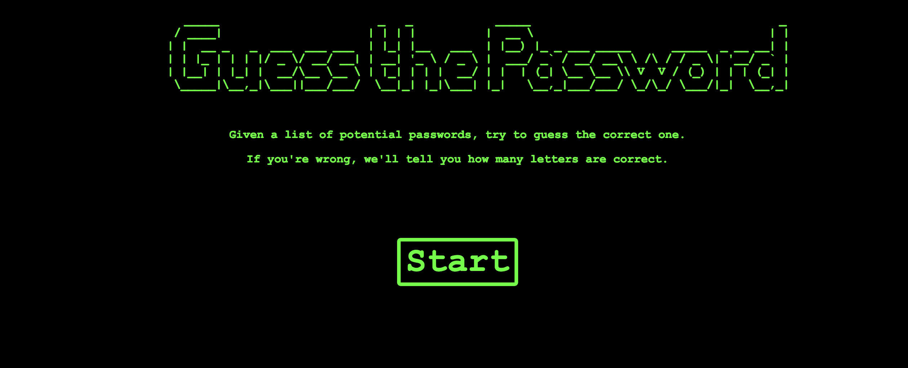

# Guess-the-Password

Simple browser game with an ES2015 and JQuery refactor. 

Link: https://guess-the-password.netlify.com/

## ES2015 Featues

1. let
2. const
3. template strings
4. arrow functions
5. rest
6. destructuring assignment
7. default params

## JQuery Featues

1. DOM Mainpulation
2. Event Handling
3. Class Toggling
